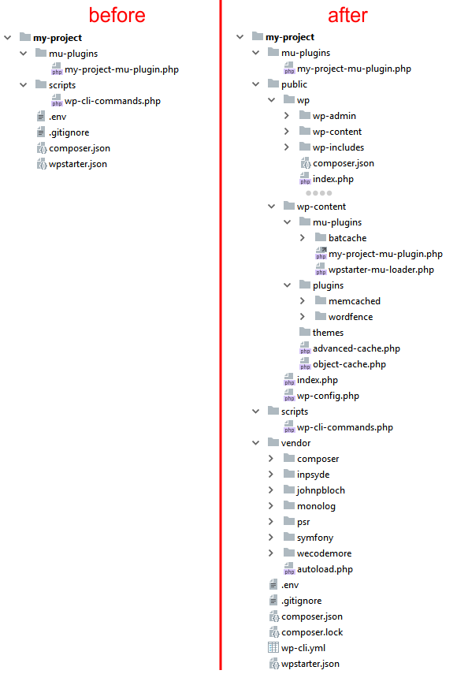
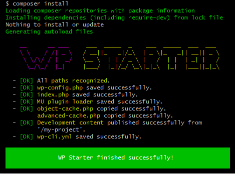

# A `composer.json` example
{: .no_toc }

## Table of contents
{: .no_toc .text-delta }

- TOC
{:toc}

## The code

The sample `composer.json` below is not very different from what can be used in a real-world WP Starter powered website:

```json
{
    "name": "my-company/my-project",
    "type": "project",
    "description": "My Project Description",
    "license": "proprietary",
    "minimum-stability": "dev",
    "prefer-stable": true,
    "require": {
        "php": ">= 7.4 < 8.3",
        "composer/installers": "^2.2",
        "wecodemore/wpstarter": "^3",
        "roots/wordpress": "~6.1.1",
        "inpsyde/wonolog": "^2",
        "wpackagist-theme/twentytwentythree": "1.0.*",
        "wpackagist-plugin/wordfence": "^7.9",
        "wpackagist-plugin/memcached": "^4.0",
        "wpackagist-plugin/batcache": "^1.5"
    },
    "config": {
        "optimize-autoloader": true,
        "allow-plugins": {
            "composer/installers": true,
            "wecodemore/wpstarter": true,
            "roots/wordpress-core-installer": true
        }
    },
    "extra": {
        "wordpress-content-dir": "public/wp-content",
        "wordpress-install-dir": "public/wp",
        "installer-paths": {
            "vendor/{$vendor}/{$name}": [
                "wpackagist-plugin/memcached",
                "type:wordpress-dropin"
            ],
            "public/wp-content/mu-plugins/{$name}": [
                "type:wordpress-muplugin",
                "wpackagist-plugin/batcache"
            ],
            "public/wp-content/themes/{$name}": [
                "type:wordpress-theme"
            ],
            "public/wp-content/plugins/{$name}": [
                "type:wordpress-plugin"
            ]
        }
    },
    "repositories": [
        {
            "type": "composer",
            "url": "https://wpackagist.org"
        }
    ]
}
```

For readability’s sake, WP Starter specific configuration will be placed in separate `wpstarter.json` file that could look like this:

```json
{
    "content-dev-dir": "./",
    "dropins": [
        "./public/wp-content/mu-plugins/batcache/advanced-cache.php",
        "./vendor/wpackagist-plugin/memcached/object-cache.php"
    ],
    "wp-cli-commands": "./scripts/wp-cli-commands.php",
    "env-bootstrap-dir": "./config",
    "early-hook-file": "./bootstrap.php",
    "env-dir": "./env",
    "db-check": "health"
}
```

But the exact same configuration could have been placed in a **`extra.wpstarter`** object in `composer.json` with exact same result.


## `composer.json` step by step

`"name"`, `"type"`, `"description"` and `"license"`, `"minimum-stability"`, and `"prefer-stable"` root properties are Composer settings not specific to WP Starter. Please refer to [Composer documentation](https://getcomposer.org/doc/) if not familiar with it. 

### Require

[`require`](https://getcomposer.org/doc/01-basic-usage.md#the-require-key) section of  `composer.json` is where we tell Composer what packages we need, and in which version.

[**`"composer/installers"`**](http://composer.github.io/installers/) is a Composer plugin that provides custom installers for application or framework specific files. In our case, requiring this package we ensure WordPress plugins and themes packages will be placed in the target wp-content folder instead of in the standard "vendor" folder.

**`"wecodemore/wpstarter"`** is the present package.

The two packages above are the only two required packages in a WP Starter powered website.

[**`"roots/wordpress"`**](https://packagist.org/packages/roots/wordpress) is an unofficial WordPress package maintained by [Roots](https://roots.io/). Even if this is not required, nor is the only way to put WordPress core on the project, this is right now the most common way (with several millions of downloads) to deal with core installations in projects managed by Composer.

The package is actually no more than a "wrapper" package to provide two different packages: the `roots/wordpress-core-no-content` that provides no more than WordPress core code and a `roots/wordpress-core-intaller` that is an installer Composer plugin that tells Composer where to place WordPress core files and folders.

[**`"inpsyde/wonolog"`**](https://inpsyde.github.io/Wonolog/) is just an example of a library (not a plugin) that we might want to add to our website. Because it is available on Packagist we just add it to requirements. It can depends on other dependencies, that can depend on other dependencies, and so on. Composer will recursively discover all the dependencies and install everything for us. If there's a conflict in dependencies version we will discover those on install, so conflicting code can not ever be released.

[**`"wpackagist-theme/twentytwentythree"`**](https://wordpress.org/themes/twentytwentythree/) is the official 2023 theme. It does not support Composer, but we can require it via *WordPress Packagist*, because we have included that in our  `"repositories"` setting.

[**`"wpackagist-plugin/wordfence"`**](https://wordpress.org/plugins/wordfence/) is an example of a plugin we might want to add to our website.  We also get it via *WordPress Packagist*. 

[**`"wpackagist-plugin/batcache"`**](https://wordpress.org/plugins/batcache/) is a plugin that is also available on *WordPress Packagist*. It represents a special case. Looking at its [source](https://plugins.trac.wordpress.org/browser/batcache/tags/1.5) it contains *both* a *MU plugin* ([`batcache.php`](https://plugins.trac.wordpress.org/browser/batcache/tags/1.5/batcache.php)) and a *dropin* ([`advanced-cache.php`](https://plugins.trac.wordpress.org/browser/batcache/tags/1.5/advanced-cache.php)). Moreover,  Composer type is `wordpress-plugin` because the wp.org repository only allows for regular plugins, not MU plugins nor dropins. We will see how, despite the messy situation, with a very minimum configuration WP Starter will handle it perfectly, placing everything in the right place without any manual intervention nor custom scripts.

[**`"wpackagist-plugin/memcached"`**](https://wordpress.org/plugins/memcached) is a dropin. Once again, it has the `wordpress-plugin` type because of wp.org limitation. And once again we can get this working easily with minimum configuration.

### Config

In recent Composer versions, Composer plugins must be enabled. The `config.allow-plugins` property is used for that scope. See [documentation](https://getcomposer.org/doc/06-config.md#allow-plugins).

### Extra

`extra` is the `composer.json` that Composer reserves for Composer plugins configuration. And that is exactly what we using it for: providing configuration for the 3 plugins we have:

- WP core installer
- WP Starter
- Composer installers

#### WP core installer configuration

WP core installer is an ["installer Composer plugin"](https://getcomposer.org/doc/articles/custom-installers.md). It tells Composer where to place the packages of type `"wordpress-core"`, that are not supported by Composer installers. By default the plugin tells Composer to install WordPress in the `./wordpress` directory, but provides the **`extra.wordpress-install-dir`** to customize it.

In our sample, we are telling to place WP in the folder `public/wp`, because having a "public" folder and WordPress folder in it.

#### WP content configuration

WP content folder is *indirectly* defined by the setting we use for plugin and themes via `"extra.installer-paths"` path (more on this below). In fact, if we tell Composer to put plugins in `public/wp-content/plugins` we are kind of *implying* that `public/wp-content` is the content folder.

However, WP Starter needs the content folder to be explicitly declared.

The way we inform WP Starter about the location of WP content folder is  **`extra.wordpress-content-dir`** setting that is designed to be symmetrical to `wordpress-install-dir` and so placed outside `extra.wpstarter` that is where all the other WP Starter settings resides.

#### Composer Installers configuration

We require Composer Installers to allow WordPress plugins, themes, MU plugins, and dropins to be placed inside WP content folder instead of default vendor folder.

By default, installers tells Composer to place those WordPress-related packages in the `/wp-content` folder inside the project root folder.

However, that does not work for us: first because we are customizing the content folder (placing it outside of WP core folder) and then because we are also customizing WP core folder.

Luckily, Composer Installers supports configuration via the **`"extra.installer-paths"`** entry. See [documentation](https://github.com/composer/installers#custom-install-paths).

With the configuration in our sample file we are telling Composer Installers to place:

- Packages of type `"wordpress-dropin"`, as well as the `wpackagist-plugin/memcached` (that we know is also a dropin with a wrong Composer type) package to the vendor folder. The dropin files are put in place by WP Starter, but we need Composer to put them somewhere, and here we tell it to put them the vendor folder like any other non-WordPress dependency.
- Packages of type `"wordpress-muplugin"`, as well as the `wpackagist-plugin/batcache` package (that we know is also a MU plugin with the wrong type) in the folder `public/wp-content/mu-plugins/{$name}`, where `$name` will be replaced by the package *name*, e. g. *"batcache"* for `wpackagist-plugin/batcache` (where *"wpackagist-plugin"* is the *vendor*);
- Packages of type `"wordpress-theme"` in the folder `public/wp-content/themes/{$name}/`, which is where WordPress will look for them.
- Packages of type `"wordpress-plugin"` in the folder `public/wp-content/plugins/{$name}/`, which is where WordPress will look for them.

It is worth noting that while this setup works for plugins and themes, it does **not** work out of the box for MU plugins and dropins. WordPress will look for MU plugins *directly* placed inside `wp-content/mu-plugins/` (no sub-folders) and dropins needs to be *directly* inside `wp-content/`.

WP Starter handles this issue for us.

The `MuLoaderStep` takes care of creating a MU plugin that acts as a "loader"  for other MU plugins that Composer placed in sub-folders of `wp-content/mu-plugins`, and the `DropinsStep` takes care of moving the dropin files directly into `wp-content`.

It is worth noting that the `"wpackagist-plugin/batcache"` contains *both* a *MU plugin* and a *dropin*, and WP Starter handles this situation pretty well with a single line of configuration. More on this below.

### Repositories

In the sample `composer.json` we used [`"repositories"`](https://getcomposer.org/doc/05-repositories.md) setting to tell Composer to use [WordPress Packagist](https://wpackagist.org/). This is a free Composer repository (maintained by [Outlandish](http://outlandish.com/)) that exposes plugins and themes available on the official [wp.org](https://wordpress.org/) repository as Composer packages.

The official Composer repository, [Packagist](https://packagist.org/), is already checked by Composer, so there's no need to add it.


## WP Starter specific configuration

 **`"extra.wpstarter"`** is the place for all the WP Starter configuration. However, WP Starter supports also a separate **`wpstarter.json`** file located at project root, and that is what we are using in our sample.

The [*"Configuration"* chapter](04-WP-Starter-Configuration.md) has a detailed explanation on how that works and the [*"Settings Cheat Sheet"* chapter ](09-Settings-Cheat-Sheet.md) lists all the available WP Starter settings.

Below there is the a step by step explanation of just the settings used in our sample `wpstarter.json`.

Please note that **all the settings are optional**.


### `content-dev-dir`

The [*"WP Starter Steps"* chapter](05-WP-Starter-Steps.md#contentdevstep) has a detailed explanation of what "development content" means in WP Starter.

In a nutshell, those are themes, plugins, MU plugins, and dropins that are placed in the same repository of the project, but are kept outside of WP content directory because that contains 3rd party dependencies and having those in separate folder makes VCS handling easier.

By default, WP Starter expects those files and folders to be placed in a `/content-dev` folder inside root. By setting `content-dev-dir` to `"./"` we are telling WP Starter that the "development content" parent folder is project root.

Which means, for example, that any plugin inside `/plugins` will be symlinked at `/public/wp-content/plugins` where WordPress will found them. Same goes for themes, MU plugins, dropins, and translation files.

In our example, the `wonolog-configuration.php` file that is located in `/mu-plugins` will be placed by WP Starter in `/public/wp-content/mu-plugins` where WordPress will find it. That way we can ignore the `/public` folder in our VCS, but keep `wonolog-configuration.php` under version control, as we surely want.


### `dropins`

The package `"wpackagist-plugin/batcache"` will be placed in `./public/wp-content/mu-plugins/batcache/` thanks to the Composer installers settings. That path works for the *MU plugin* file it actually ships (thanks to the loader that WP Starter creates), but not for the *dropin* file the package *also* provides.

In the same way, `"wpackagist-plugin/memcached"` will be placed in `./vendor/wpackagist-plugin/memcached/` but we need the `object-cache.php` it contains into the wp-content root.

The `dropins` settings in our `wpstarter.json` sample is an array of dropin file paths that WP Starter has to place in the proper folder. By simply listing the source paths WP Starter will know what to do, and everything will be setup without any additional script or manual intervention.


### `wp-cli-commands`

There's an entire documentation chapter, [*"WP CLI Commands"*](07-WP-CLI-Commands.md), that explains the ins and outs of running WP CLI commands via WP Starter (and why it might be worth to do it) .

So we are not going to explain the purpose of `wp-cli-commands` again here, we can just say that the file located at `./scripts/wp-cli-commands.php` will return an array of commands to be passed to WP CLI for execution.

We don't have to worry about installing WP CLI: WP Starter will do that for us if needed.


### `env-dir`

This is the folder where WP starter will look for `.env` files. If not provided, it will be the project root. Refer to the [*"Environment Variables"* chapter](02-Environment-Variables.md#introducing-env-files) for details.


### `env-bootstrap-dir`

Besides environment variables, WP Starter also allows for environment-specific PHP files. These are PHP files named per environment, e. g. `production.php`. These file are loaded very early, and can be used to configure WordPress per environment. 

The [*"WordPress Integration"* chapter](03-WordPress-Integration#environment-specific-php-file) has more details about this.

By default, these files are searched in the same folder that contains `.env` files, but this setting allows use to set a different folder. 


### `early-hook-file`

This is a file that is loaded by WP Starter very early, and can be used to add early configuration. Even if WordPress is not fully loaded (we we can't *directly* use most of the WP functionalities) we can use WP actions and filters.

The [*"WordPress Integration"* chapter](03-WordPress-Integration#early-hook-file) has more details about this.


### `db-check`

By default, when WP Starter founds database credentials in the environment, it checks for the database to be reachable. By setting this configuration to `health` we are telling WP Starter to do a more advanced health check using `mysqlcheck` binary. 


## A look at the folder structure

By looking at the sample `composer.json` above, we can guess what could be a possible folder structure of the project _before_ and *after* Composer and WP Starter runs, with highlight of the files and folders created by WP Starter:



*(Note: most of files in WP root has been removed for readability sake)*

In between, there's Composer and WP Starter running, with this output:



When WP Starter finishes, if webroot is correctly pointing to `/public`, and the `.env` file contains the necessary DB configuration, then our website is already working.


------

**Next:** [WP CLI Commands](07-WP-CLI-Commands.md)

---

- [Introduction](01-Introduction.md)
- [Environment Variables](02-Environment-Variables.md)
- [WordPress Integration](03-WordPress-Integration.md)
- [WP Starter Configuration](04-WP-Starter-Configuration.md)
- [WP Starter Steps](05-WP-Starter-Steps.md)
- ***A Commented Sample `composer.json`***
- [WP CLI Commands](07-WP-CLI-Commands.md)
- [Custom Steps Development](08-Custom-Steps-Development.md)
- [Settings Cheat Sheet](09-Settings-Cheat-Sheet.md)
- [Command-line Interface](10-Command-Line-Interface.md)
